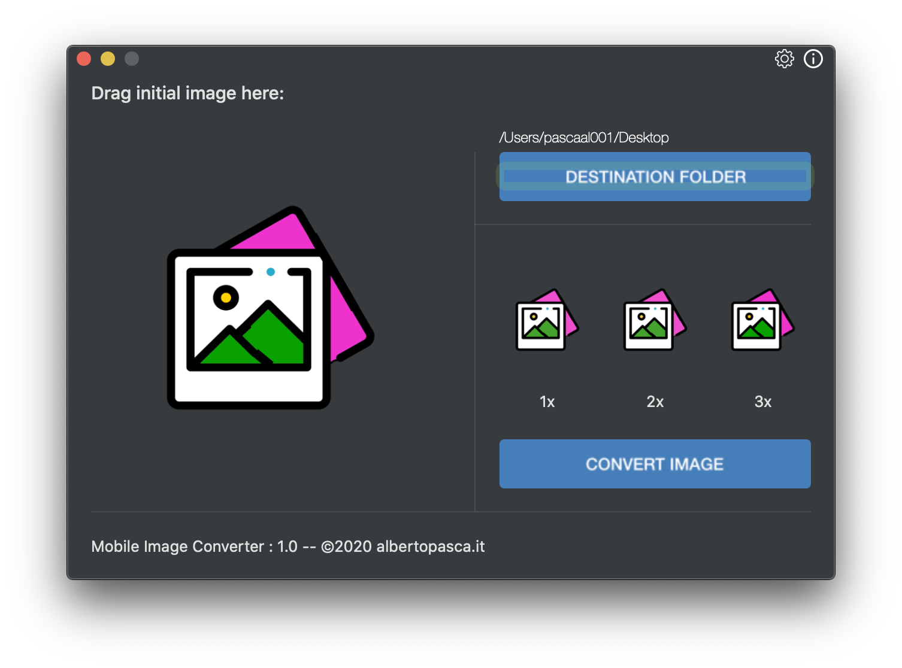

#  App Icon Maker   

A simple macOS utility to create your mobile ready assets in the format **@3x, @2x and @1x**.

Simply, **drag 'n drop** your image and press *convert*.  

---

### Screenshots:

  

---

### Installation

`$ cd AppIconMaker/`  
`$ pod install`  
`$ xed .`

√

---

Pull requests are welcome.

--- 

### Download

Too lazy?  

**Download** the executable from here:  
- [**AppIconMaker.zip**](AppIconMaker.zip)
